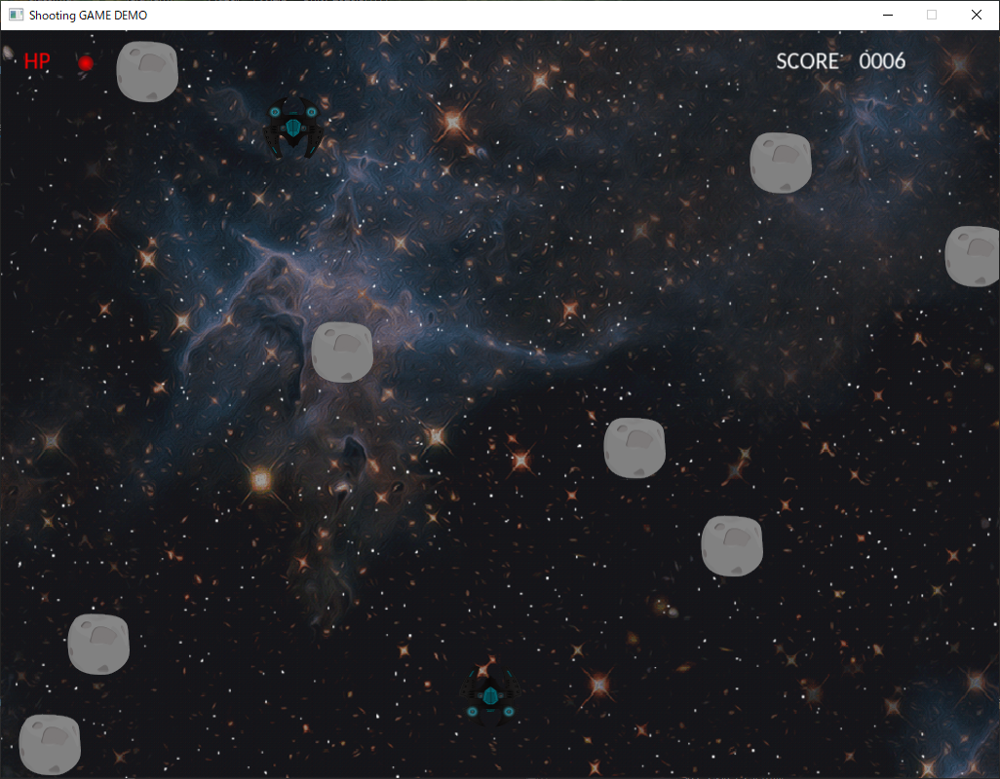
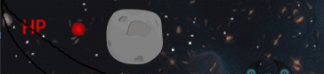
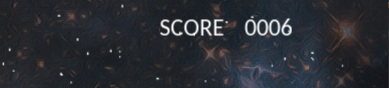
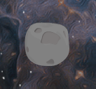
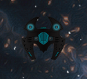

# ゲームデモ概要

- プレイヤーである宇宙船を操作し、隕石や敵の宇宙船を破壊していくゲームデモです。
  - プレイヤーの宇宙船は上下左右への移動と回転、前方へのレーザーの発射が可能です。

- 画面の左上にプレイヤーである宇宙船のHPである赤い丸が表示されています。
- 隕石や敵の宇宙船の攻撃に接触すると、HPは一つ減ります。
- HPは最大値が3で、0になる(赤い丸が無くなる)とゲームオーバーとなります。

- 敵の宇宙船と隕石を破壊することでスコアが上がっていきます。

- 敵の宇宙船と隕石は下記の画像のようなオブジェクトです。
  - 隕石はプレイヤーのレーザーを当てることで破壊できます。
  - 敵の宇宙船はプレイヤーのレーザーを三発当てることで破壊できます。

# ゲームデモ操作方法

- ゲームデモ内での操作キーの割り当てについて下記に記します。

| キー | ゲームデモ内での操作 |
| --- | --- |
| Dキー | プレイヤーが右へ動く |
| Aキー | プレイヤーが左へ動く |
| Wキー | プレイヤーが上へ動く |
| Sキー | プレイヤーが下へ動く |
| スペースキー | レーザーを正面方向に発射する |
| 右十字キー | プレイヤーが時計回りに回転する |
| 左十字キー | プレイヤーが反時計回りに回転する |

# ゲームデモ設計・開発環境

## 開発環境

| 項目 | 仕様環境 | バージョン |
| --- | --- | --- |
| OS | windows | Windows10 | 
| グラフィックスライブラリ | OpenGL | 3.3 |
| グラフィックス補助ライブラリ | GLEW | 7.0 |
| マルチメディアライブラリ | SDL | ver2.0 |
| ビルド環境 | Visual Studio | Microsoft Visual Studio Community 2019 |

## 設計

このゲームデモに関するシステム設計に関してここで説明します。

### クラス設計

このゲームデモ内におけるクラスの関連について、以下のリンク先にて記述しています。

- [クラス設計](/doc/class.md)

### コリジョン設計

このゲームデモ内におけるコリジョンの仕組みに関する設計を下記のリンク先にて記述しています。

- [コリジョン設計](/doc/collision.md)

### メタAI設計

このゲームデモでは、キャラクターAI(エージェントAI)は使用せず、メタAIで敵の設定を行っています。
そのメタAIの設計を下記のリンク先にて記述しています。

- [メタAI設計](/doc/metaAI.md)

## 使用素材・参考資料

- 下記の資料を参考に作成いたしました。素材も下記のプロジェクトからお借りしております。
  - https://github.com/gameprogcpp/code
  - [ゲームプログラミングC++](https://www.amazon.co.jp/%E3%82%B2%E3%83%BC%E3%83%A0%E3%83%97%E3%83%AD%E3%82%B0%E3%83%A9%E3%83%9F%E3%83%B3%E3%82%B0C-SanjayMadhav-ebook/dp/B07JVMJ9B1/)

- ライセンスに関しては、上記の資料を踏襲し、BSDライセンスとなっております。詳しくは[こちら](/LICENSE)

