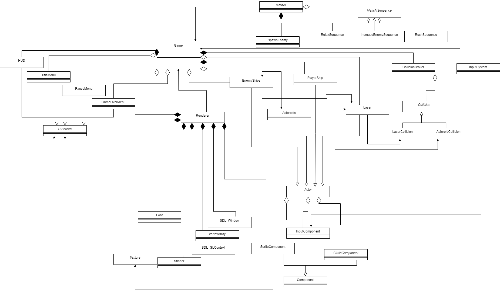

# クラス設計

ここでは、ゲームデモ内のクラス設計に関して記述します。
下記にクラス図に関して示します。

- GameクラスはMVCで言うところのModelに該当します。ゲーム内のオブジェクトは全てGameクラスが所持します。

- RendererクラスはViewに該当します。各アクターのスプライトの管理のため、Gameクラスも参照します。
  - 各アクターのスプライト管理は例外的なものとし、その他の描画に関してはRendererクラスで行います。

- UIに関しては、必要な時にゲーム画面の上に作成します。
  - HUDのみは常に表示されています。

- 衝突処理に関してはGameクラスが持つCollisionBrokerクラスにて管理します。
  - Collisionクラスを継承したクラスをCollisionBrokerが持ち、Collisionクラスを継承したクラス内で各オブジェクトごとの衝突処理を行います。

