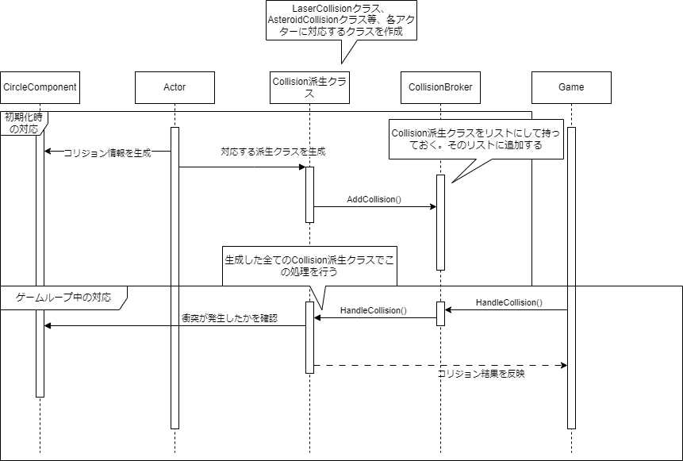

# 衝突処理設計

- 衝突処理に関しては、衝突処理を行うオブジェクトに対応するCollisionクラスを継承したクラスを作成して対応します。シーケンスとしては下記のようになります。

- 初期化時は、ゲーム内のオブジェクトに該当するActorクラスにて、衝突処理の判定を行うCircleComponentクラスと、Collisionクラスを生成します。
  - 例えば、ゲーム内の隕石であるasteroidクラスでは、AsteroidCollisionクラスを作成し、このAsteroidCollisionクラスを、衝突処理を管理するCollisionBrokerクラスが持つvector型のメンバ変数に格納します。

- ゲームループの中で、CollisionBrokerクラスが持つvector型のメンバ変数に格納された、Collisionクラスを継承したクラスで定義されている衝突処理を行います。
  - ここでいう衝突処理は、対象のオブジェクトが衝突しているかどうかを確認し、衝突していれば、衝突したオブジェクトに対応した処理を行うことを言います。

